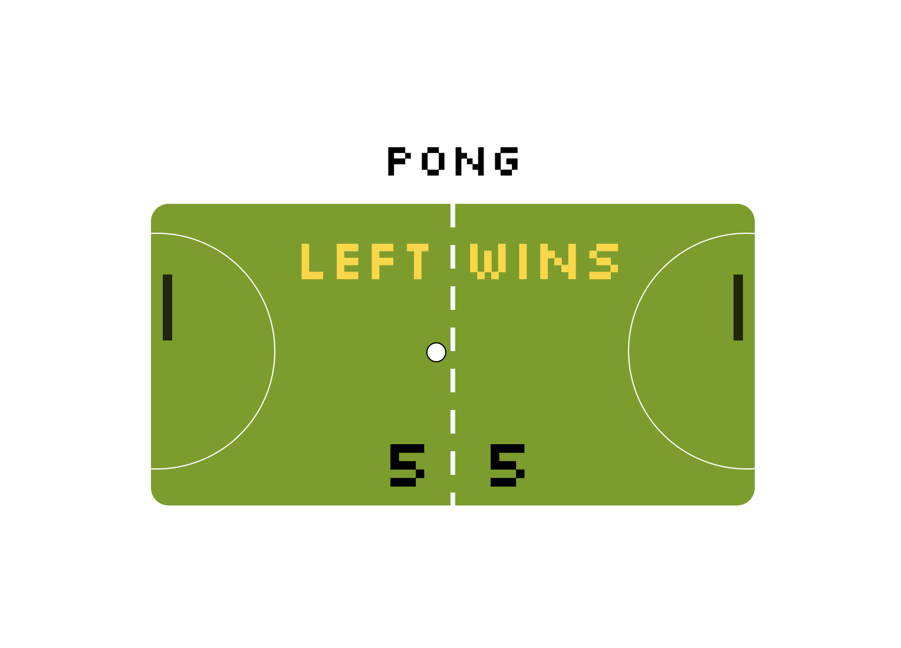

Pong game using SVGs.

    Using Javascript/SVGs, I created a simple Pong game with subtle but noticeable changes to the ball's acceleration physics. Players must reach 5 goals to win the game.
    
    Purpose: Try and deflect ball into goal behind paddle while also defending your own goal.

## Keys

**Player Left:**

- a: up
- z: down

**Player Right:**

- ▲ : up
- ▼: down

- Spacebar: Pause

_game is paused once player gets 5 points_

Technologies used:

    - HTML/CSS
    - Javascript 
    - Webpack

    When goal limit is reached, the game is paused with an SVG element (stored in Winner.js partial) declaring winner. For each goal, a sound effect is played (sound clip from: https://freesound.org/) and a goal tally is added on screen.

    Ball speed was increased and background colours were changed to add a "soccer pitch" feeling to the game.

Learnings:
    Working with javascript to build a pong game. Using constructors and SVGs to make proper shapes then using Javascript to add parameters on how the ball behaves. Using these compined makes a pong game. Much harder than it looks..

## Setup

**Install dependencies:**

`> npm i`

**Run locally with Webpack Dev Server:**

`> npm start`

**Build for production:**

`> npm run build`

Author: Jeff Liknes
